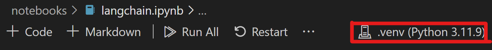

# RAG Samples

Use this repository to explore common components of Retrieval Augmented Generation (RAG) applications. RAG allows you to bring your data to large language models, without needing to train or fine-tune the model itself.

Before you start, make sure you install the following:
* Python 3.11 or later
* An IDE with Python support (Visual Studio Code, PyCharm, Jupyter)
* Docker Desktop (to run the Community database for these exercises)

## Get started

1. [Clone the repository](#clone-the-repository)
2. [Create the database](#create-the-database)
3. [Run the notebooks](#run-the-notebooks)
4. [Destroy the database](#destroy-the-database)

## Clone the repository
```
git clone https://github.com/intersystems/samples-rag.git
```
If you do not have Git installed, download the repository and extract into a new directory.

## Create the database
You can run a Community version of InterSystems IRIS data platform using Docker:
```
docker pull intersystemsdc/iris-community:latest

cd Samples-RAG-Application

docker-compose up 
```
The docker composition maps ports 51972 and 52775 to the IRIS Container. You can modify the port mappings directly in the docker-compose.yml, and run the docker-compose up command again.

## Run the notebooks
Before running the notebooks, create a Python environment to install all dependencies and packages:
```
cd samples-rag

python -m venv ./.rag-samples-venv
```
This will create a directory (.rag-samples-venv) in your cloned directory.
Now you can install the Python packages in this environment, without affecting the global Python environment.
```
cd samples-rag

./.rag-samples-venv/Scripts/Activate.ps1         ## PowerShell
./.rag-samples-venv/Scripts/activate.bat         ## Windows Command Prompt
source ./.rag-samples-venv/Scripts/activate      ## Bash

pip install -r requirements.txt
```
Take a look at the requirements.txt file in the repo if you are unsure about any imported Python packages. You can check which packages are installed with:
```
pip list
```

In your IDE, choose .rag-samples-venv as your Python kernel before running any of the notebooks. In Visual Studio Code, once you open a notebook in the editor, you can click the kernel icon in the top bar:





Walk through the notebooks in this order:

1. data_loader.ipynb
2. chain_of_thought.ipynb
3. memory.ipynb
4. agents.ipynb

There is also a sample chatbot application in the `./notebooks/rag_app` directory.

In the .rag-samples-venv Python virtual environment, run the following command to start the application:

```
cd Samples-RAG-Application

streamlit run .\notebooks\rag_app\streamlit_app.py
```

The application will use host port 8501. You can query it on all the same information from the previous exercises.

## Destroy the database
Once you are finished, you can stop the IRIS Container and destroy all resources.

1. Stop the container if it is running:
```
cd Samples-RAG-Application

docker-compose down
```
You can also stop the container from Docker Desktop.

2. Remove dangling images
```
docker system prune
```
